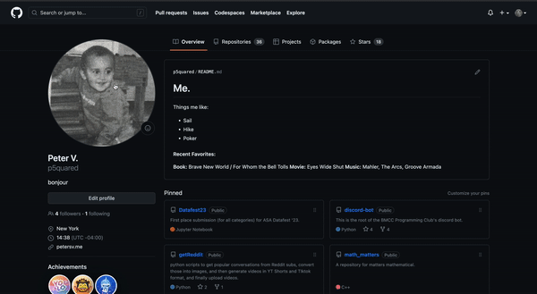

# Alt-o-Matic
A simple Chrome extension which automatically generates alt text for images in your browser.

## Installation
1. Clone this repository
2. Open Chrome and navigate to `chrome://extensions`
3. Enable developer mode
4. Click `Load unpacked` and select the cloned repository
5. Enjoy! 